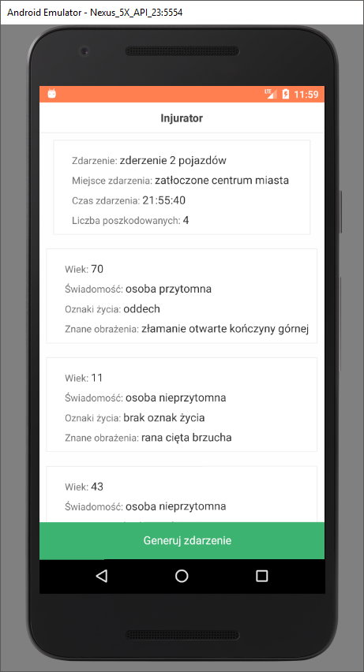

# Injurator

App is build for medical emergency students, to provide random emeregncy situations for training and simulations.

## Built With

* [React Native](http://facebook.github.io/react-native/) - The framework used
* [npm](https://www.npmjs.com/) - Dependency Management
* [Firebase](https://firebase.google.com/) - Real Time Database
* [Android Studio](https://developer.android.com/studio/index.html) - SDK and Virtual machine
* [Atom](https://atom.io/) - Code editor

## To do

* Redux
* Event customization interface for users
* Registration
* Functionality to supplement database
